# SafeMate Workflow Diagram

## Complete User Journey: Landing Page to Wallet Creation

This document contains the visual workflow diagrams for the SafeMate application, showing the complete user journey from landing page to wallet creation with all supporting AWS services.

---

## 🎯 Main Workflow Diagram

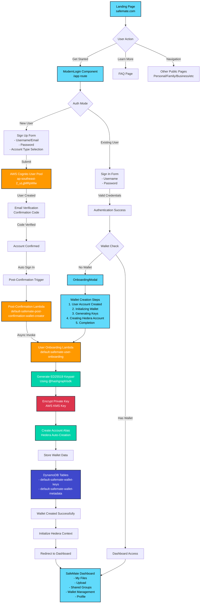

---

## 🔐 Authentication Flow Detail

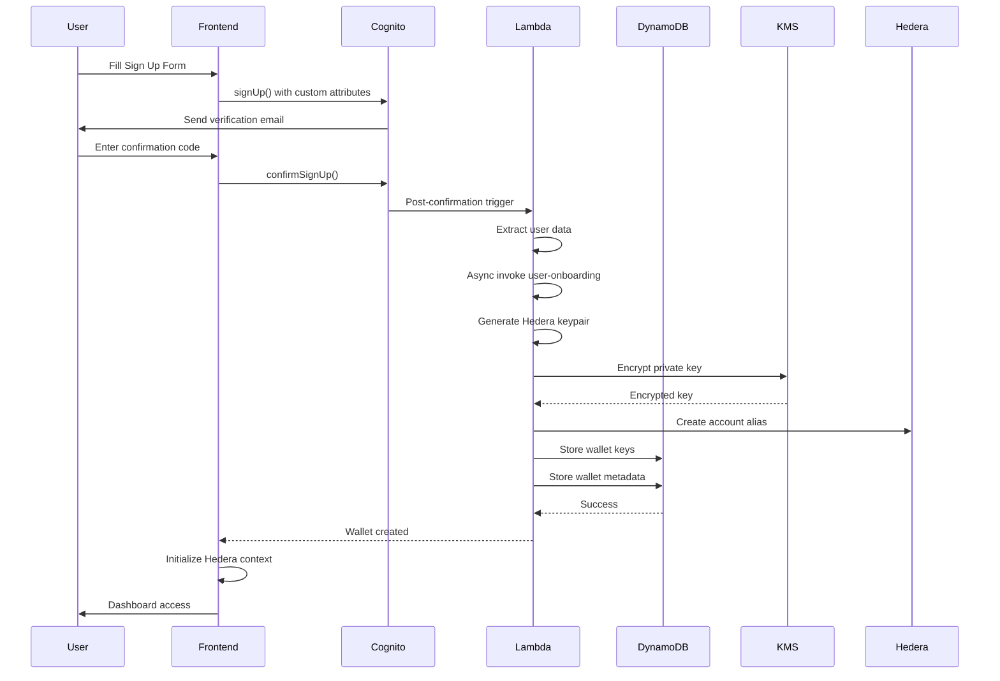

---

## 🏗️ AWS Infrastructure Architecture

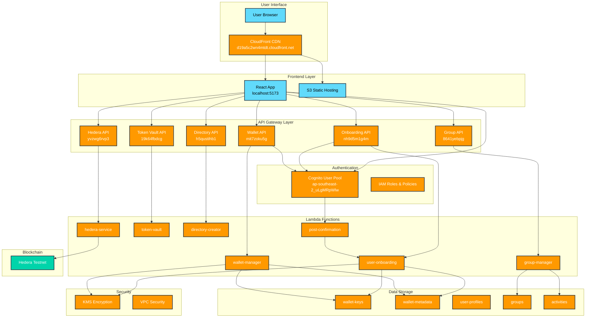

---

## 🔄 Wallet Creation Process Detail

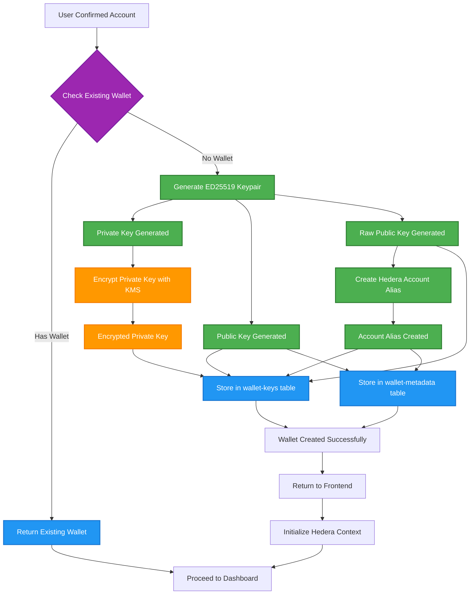

---

## 📱 Frontend Component Flow

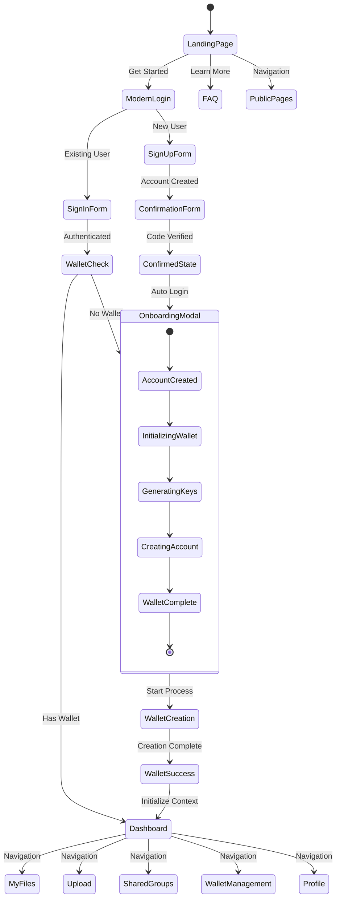

---

## 🔐 Security Flow Diagram

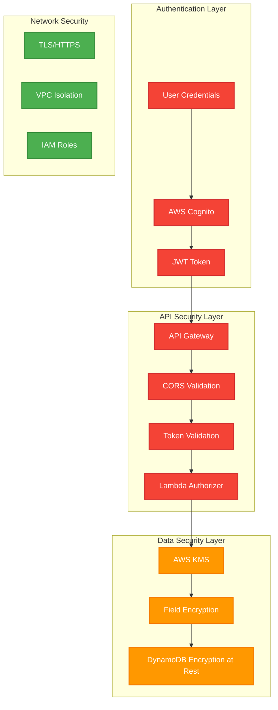

---

## 📊 Data Flow Architecture

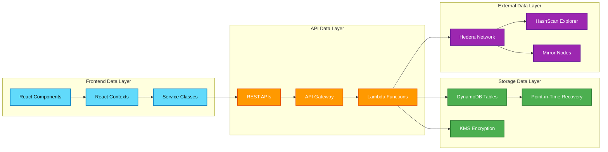

---

## 🎯 Complete User Journey Timeline

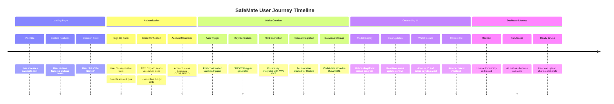

---

## 📋 Component Interaction Map

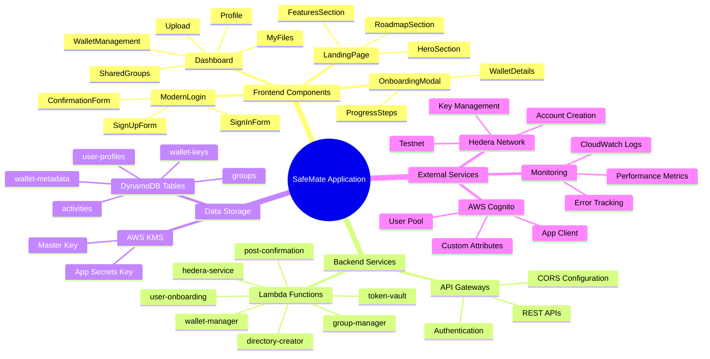

---

## 🚀 Deployment Architecture

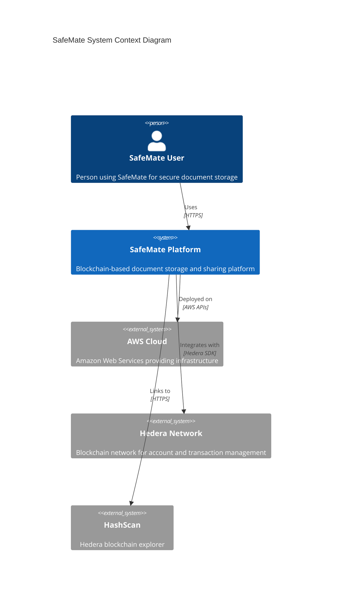

---

## 📈 Performance Flow

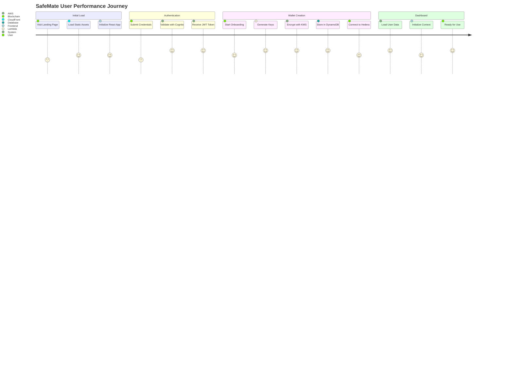

---

## 🔧 Development Workflow

```mermaid
gitgraph
    commit id: "Initial Setup"
    branch development
    checkout development
    commit id: "Frontend Components"
    commit id: "Authentication Flow"
    commit id: "Lambda Functions"
    branch feature/wallet
    checkout feature/wallet
    commit id: "Wallet Creation"
    commit id: "Hedera Integration"
    checkout development
    merge feature/wallet
    commit id: "Integration Testing"
    checkout main
    merge development
    commit id: "Production Deploy"
    commit id: "Current State"
```

---

## 📖 How to Use These Diagrams

### 1. Main Workflow Diagram
- Use for understanding the complete user journey
- Reference for new team member onboarding
- Architecture discussions and planning

### 2. Sequence Diagrams
- Debug authentication issues
- Understand service interactions
- Optimize API call patterns

### 3. Infrastructure Diagrams
- AWS resource planning and management
- Cost optimization discussions
- Security reviews and audits

### 4. Component Flow Diagrams
- Frontend development planning
- State management optimization
- User experience improvements

### 5. Security Flow Diagrams
- Security audits and reviews
- Compliance documentation
- Penetration testing planning

---

## 🛠️ Diagram Maintenance

### Updating Diagrams
1. **Service Changes**: Update when new AWS services are added
2. **Flow Changes**: Modify when user workflow changes
3. **Component Updates**: Reflect new frontend components
4. **Security Updates**: Include new security measures

### Diagram Tools
- **Mermaid**: Used for all diagrams in this document
- **Live Editor**: https://mermaid.live/
- **VSCode Extension**: Mermaid Preview
- **Documentation**: https://mermaid.js.org/

### Version Control
- **File Location**: `SAFEMATE_WORKFLOW_DIAGRAM.md`
- **Git Tracking**: Track changes with git commits
- **Documentation**: Update with code changes
- **Review Process**: Include in code review cycles

---

*Last Updated: January 2025*
*Diagrams represent current production state*
*All AWS services operational in ap-southeast-2*
